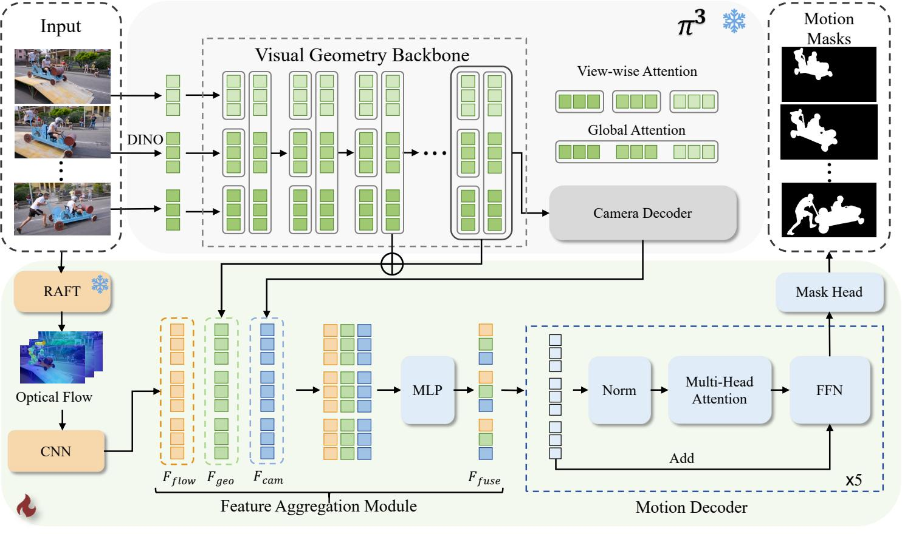

<div align="center">

<h1>GeoMotion: Rethinking Motion Segmentation via Latent 4D Geometry</h1>

<div>
    <a href='#' target='_blank'>Xiankang He</a><sup>1,2</sup>&emsp;
    <a href='#' target='_blank'>Peile Lin</a><sup>1,2</sup>&emsp;
    <a href='#' target='_blank'>Ying Cui</a><sup>1,2</sup>&emsp;
    <a href='#' target='_blank'>Dongyan Guo</a><sup>1,2*</sup>&emsp;
    <a href='#' target='_blank'>Chunhua Shen</a><sup>1,2,3</sup>&emsp;
    <a href='#' target='_blank'>Xiaoqin Zhang</a><sup>1,2</sup>
</div>
<div>
    <sup>1</sup> ZJUT&emsp;
    <sup>2</sup> Zhejiang Key Laboratory of Visual Information Intelligent Processing&emsp;
    <sup>3</sup> ZJU
</div>
<div>
    <sup>*</sup> Corresponding author
</div>

<br>

<!-- Badges -->
[](http://arxiv.org/abs/2602.21810)
[](https://huggingface.co/xingyang1/GeoMotion/blob/main/best_model.pth)
[](https://opensource.org/licenses/MIT)

<!--  -->
<!-- *GeoMotion effectively disentangles object motion from camera motion by leveraging 4D geometric priors.* -->

</div>

## 📖 About GeoMotion

We present **GeoMotion**, a new feed-forward motion segmentation framework that directly infers dynamic masks from latent 4D geometry. It elegantly combines 4D geometric priors from a pretrained reconstruction model ($\pi^3$) with local pixel-level motion from optical flow. This enables the disentanglement of object motion from camera motion in a single pass.

<!-- TODO: Add your pipeline/architecture image here -->


## 🔥 News / Updates

- **[2026.02]** 🚀 Training code, evaluation code, and pretrained models will be gradually updated!
- **[2026.02]** GeoMotion paper is available on ArXiv.

---

## ⚙️ 1. Environment Setup

Our model has been developed and tested on an **NVIDIA GeForce RTX 5090**.

To set up the environment, run the following commands:

```bash
conda create -n geomotion python=3.12 -y
conda activate geomotion

# requirements.txt is based on the Pi3 environment dependencies
# If needed, install a PyTorch build matching your CUDA runtime first.
# Example tested setup (CUDA 12.8):
# torch 2.9.0.dev20250905+cu128, torchvision 0.24.0.dev20250905+cu128
pip install -r requirements.txt
```

## 📦 2. Pretrained Models

Please download the required weights and place them inside the `checkpoint/` directory.

| Model | Description | Expected Path | Download Link |
| :--- | :--- | :--- | :--- |
| **PI3 Backbone** | Backbone initialization | `checkpoint/model.safetensors` | [🤗 HuggingFace (Pi3)](https://huggingface.co/yyfz233/Pi3/resolve/main/model.safetensors) |
| **GeoMotion** | Trained motion segmentation model | `checkpoint/best_model.pth` | [🤗 HuggingFace (GeoMotion)](https://huggingface.co/xingyang1/GeoMotion/blob/main/best_model.pth) |

## 📂 3. Dataset Preparation

### 3.1 Evaluation Datasets

Our dataset preparation follows the same steps as outlined in [OCLR](https://github.com/Jyxarthur/OCLR_model):


<details>
<summary><b>Expected local directory layout (Click to expand)</b></summary>

```text
data/
├── DAVIS/
│   ├── JPEGImages/480p/<sequence>/*.jpg
│   └── Annotations/480p/<sequence>/*.png
├── DAVIS2017-M/
│   └── DAVIS/
│       ├── JPEGImages/480p/<sequence>/*.jpg
│       └── Annotations/480p/<sequence>/*.png
├── FBMS59_clean/
│   ├── JPEGImages/<sequence>/*
│   └── Annotations/<sequence>/*
└── SegTrackv2/
    ├── JPEGImages_jpg_standardized/<sequence>/*
    └── GroundTruth/<sequence>/*
```
</details>

### 3.2 Training Datasets

The current training configuration (`configs/pi3_conf_low_35_feature_flow_gotm_verse_stop_all.yaml`) utilizes the following datasets:
- [GOT-10k](https://got-10k.aitestunion.com/)
- [HOI4D](https://hoi4d.github.io/)
- [DynamicStereo](https://github.com/facebookresearch/dynamic_stereo/tree/main)
- [DynamicVerse](https://huggingface.co/datasets/kairunwen/DynamicVerse/tree/main)

> ⚠️ **Important:** In your config file, `train_root` **must** be in the exact same order as `train_dataset`.

```yaml
train_dataset: ["got10k", "hoi4d", "dynamic_stereo", "gotmoving", "dynamicverse"]

train_root:
  - /path/to/GOT-10k_Train_split_01
  - /path/to/HOI4D_clean
  - /path/to/dynamic_stereo_root
  - /path/to/got_train_video_roots_with_masks.txt
  - /path/to/DynamicVerse
```

## 🚀 4. Inference and Visualization

### 4.1 Quick Start (Batch Inference)

We provide `vis_all.sh` as the recommended entry point for batch inference and visualization.

```bash
bash vis_all.sh
```

Advanced usage (override default paths using environment variables):

```bash
# Use custom paths
MODEL_PATH=logs/your_run/best_model.pth \
DATASET_DIR=data/demo_sequences \
OUTPUT_DIR=output/demo \
bash vis_all.sh

# Provide RAFT / SAM2 paths explicitly
RAFT_MODEL_PATH=checkpoint/raft_large.pth \
SAM2_CONFIG_PATH=configs/sam2.1/sam2.1_hiera_l.yaml \
SAM2_CHECKPOINT_PATH=sam2-main/checkpoints/sam2.1_hiera_large.pt \
bash vis_all.sh
```

### 4.2 Single Sequence Inference

For more granular control, you can run the Python script directly on a single sequence:

```bash
python motion_seg_inference.py \
  --model_path checkpoint/best_model.pth \
  --pi3_model_path checkpoint/model.safetensors \
  --input_dir data/test/<sequence_name> \
  --output_dir output/single \
  --sequence_length 32 \
  --threshold 0.5
```

### 4.3 Entire Dataset Inference

Replace `--input_dir` with `--dataset_dir` to process multiple sequences at once:

```bash
python motion_seg_inference.py \
  --model_path checkpoint/best_model.pth \
  --pi3_model_path checkpoint/model.safetensors \
  --dataset_dir data/test \
  --output_dir output/test \
  --sequence_length 32 \
  --threshold 0.5
```

## 📊 5. Evaluation

### 5.1 Evaluate a Single Dataset

```bash
python eval.py \
  --model_path checkpoint/best_model.pth \
  --pi3_model_path checkpoint/model.safetensors \
  --output_dir eval/davis2016 \
  --image_root data/DAVIS/JPEGImages/480p \
  --annotation_root data/DAVIS/Annotations/480p \
  --sequence_length 32 \
  --use_sam_refine True \
  --davis 2016
```

Supported `--davis` flags: `2016`, `2017`, `davis-all`, `2016-M`, `2017-M`, `fbms`, `segtrack`.

### 5.2 Batch Evaluation Script

`eval.sh` runs evaluation on multiple datasets in one command. It is environment-variable driven, so most users do not need to edit the script.

```bash
bash eval.sh
```

Default evaluated datasets: `2016-M, 2017-M, 2016, segtrack, fbms`.

Customizing batch evaluation (`DATASETS_CSV`):

```bash
# Evaluate only DAVIS 2016 and FBMS
DATASETS_CSV=2016,fbms bash eval.sh

# Evaluate one dataset with a custom model
MODEL_NAME=my_run \
MODEL_PATH=logs/my_run/best_model.pth \
DATASETS_CSV=segtrack \
bash eval.sh
```

If your datasets are not under the default `data/` layout, either:
- set `ROOT_DIR` to your repo root (default is the script directory), or
- edit the dataset path mapping inside `eval.sh` (`resolve_dataset_roots()`).

## 🏃‍♂️ 6. Training

### 6.1 Configure Paths

Edit `configs/pi3_conf_low_35_feature_flow_gotm_verse_stop_all.yaml`:
- `train_dataset` (recommended: `["got10k", "hoi4d", "dynamic_stereo", "gotmoving", "dynamicverse"]`)
- `train_root`, `test_root`, `log_dir`
- `vggt_model_path` (PI3 `.safetensors` path)
- `raft_model_path` (optional RAFT checkpoint path; can also use `RAFT_MODEL_PATH`)

### 6.2 Start Training

```bash
bash train.sh
```

`train.sh` supports these environment variables:
- `CUDA_DEVICE`
- `MASTER_PORT`
- `NPROC_PER_NODE`
- `CONFIG_PATH`

Or run explicitly via `torchrun`:

```bash
CUDA_VISIBLE_DEVICES=0 torchrun --master-port=29502 --nproc_per_node=1 train.py configs/pi3_conf_low_35_feature_flow_gotm_verse_stop_all.yaml
```

Checkpoints and logs will be saved to the `log_dir` specified in your config.

## 🙏 7. Acknowledgements

This project builds on and benefits from the following excellent open-source works. We thank the authors for their contributions to the community:

- [Pi3](https://github.com/yyfz/Pi3)
- [SegAnyMotion](https://github.com/nnanhuang/SegAnyMo)
- [RoMo](https://github.com/google-deepmind/romo)
- [OCLR](https://github.com/Jyxarthur/OCLR_model)
- [VGGT](https://github.com/facebookresearch/vggt)
- [Easi3R](https://github.com/Inception3D/Easi3R/tree/main)

## 📝 8. Citation

If you find GeoMotion useful for your research or applications, please cite using this BibTeX:

```bibtex
@misc{he2026geomotion,
      title={GeoMotion: Rethinking Motion Segmentation via Latent 4D Geometry}, 
      author={Xiankang He and Peile Lin and Ying Cui and Dongyan Guo and Chunhua Shen and Xiaoqin Zhang},
      year={2026},
      eprint={2602.21810},
      archivePrefix={arXiv},
      primaryClass={cs.CV},
      url={https://arxiv.org/abs/2602.21810}, 
}
```
